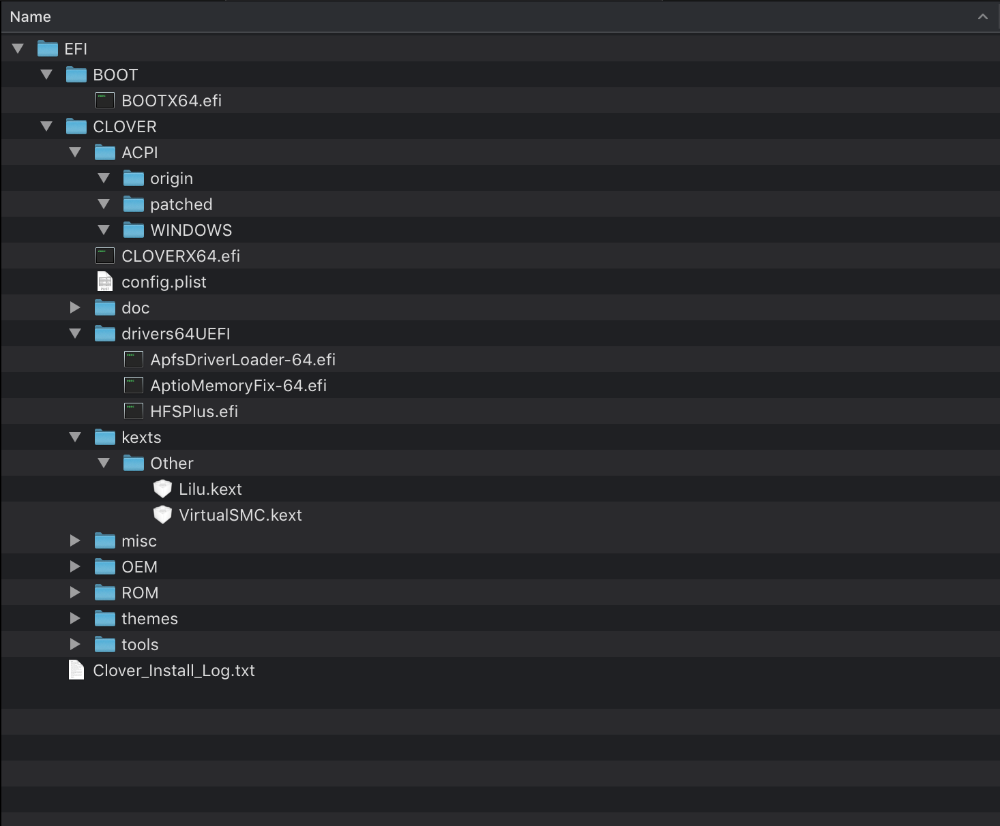

# Minimal Clover Config and Drivers for Gigabyte Z390 I WIFI

>“Don't multiply entities beyond necessity.” --William of Ockham

*[PRs](https://github.com/icymind/hackintosh/pulls) are welcome!*

## UPDATE
- 20190925 update macOS to 10.14.6
- 20190925 update hackintosh to 2.8.0
- 20190925 update Model to iMac19,2

## Why minimal

There are many tutorial and builds around the hackintosh community, but most of them use a lot of clover config and kexts, and those value/kexts lacks of explanation. I tried to search the meaning of the clover config item, but neither clover wiki nor forum (even golden builds) offer an answers. When someone ask questions in tonymacx or other hackintosh forums, most of time what they get is not an answers, but an EFI.zip. Sometimes an EFI.zip is shortcut to success maybe, but the "blackbox" do not offer any knowledge to solve problems.

So I want to build a hackintosh with minimal config and kexts, maybe I don't know how they works in detail, but I know what they use for at least.

Correct me if I am wrong!

## Parts

- Gigabyte Z390 I WIFI
- Intel i7 9700K
- Corsair LPX DDR4 3000 16GB x2
- Samsung 970Evo 500G for macOS
- Samsung 970Evo 250G for Windows
- Western Digital 2.5' 1TB HDD
- Asus USB-AC53-Nano Wi-Fi Adapter
- SAPPHIRE PULSE ITX Radeon™ RX 570 4GD5

## Environment

The installation base on [hackintosh-vanilla-desktop-guide](https://hackintosh.gitbook.io/-r-hackintosh-vanilla-desktop-guide/) (with excellent explanation).

- macOS version: Mojave 10.14.6
- BIOS version: f5d
- CLOVER version: v2.4k r4894. (r4897, r4896, r4895 tested, can't boot.)
- hackintool: v2.8.0

## Pre-Installation

- BIOS setting
  - "Load Optimized Defaults" then "Save and Exit"
  - "iGPU" to "enabled"
  - That's it, everything works fine. it doesn't matter what the values of those options are:
    - Windows 8/10 Features. It's OK with default value "Windows 8/10"
    - CSM Support. It's OK with default value "Enabled""
    - XHCI Hand-off. It's OK with default value "Disabled"
    - Vt-d. It's OK with default value "Enabled"
    - XMP. optional, choose Profile1 if you have supported RAM.

- Create Installation Media
  - It doesn't matter what usb stick you use. Both USB 2.0 and 3.0 works well.
  - download macOS from Mac App Store
  - follow the vanilla tutorial
    ```bash
    # find usb device number
    diskutil list

    # format usb device, replace # with your usb device number
    diskutil partitionDisk /dev/disk# GPT JHFS+ "USB" 100%

    # create install media
    sudo "/Applications/Install macOS Mojave.app/Contents/Resources/createinstallmedia" --volume /Volumes/USB
    ```

- Install Clover to USB stick
  - install clover, click "Change Install Location" then choose your usb device.
  - click 'Customize' button at left bottom
    - check 'Clover for UEFI booting only'
    - check 'Install Clover in the ESP'
    - under 'UEFI drivers', check 'ApfsDriverLoader-64.efi', 'AptioMemoryFix-64.efi', 'HFSPlus.efi'
    - uncheck others

- Cleanup EFI folder
  - mount EFI folder with [Hackintool](http://headsoft.com.au/download/mac/Hackintool.zip)
  - delete 'drivers64' folder under 'EFI/CLOVER', we don't need lagency drivers as we boot via UEFI only
  - in 'EFI/CLOVER/drivers64UEFI', 3 drivers: 'ApfsDriverLoader-64.efi', 'AptioMemoryFix-64.efi', 'HFSPlus.efi' are enough, delete others. 'ApfsDriverLoader-64.efi' allow clover to read/write apfs partions, 'AptioMemoryFix-64.efi' for memory management, 'HFSPlus.efi' for reading/writing HFS partions and faster than 'VBoxHfs-64.efi' driver. Network, Audio and Video kexts are unnecessary at installation.
  - copy [lilu.kext](https://github.com/acidanthera/Lilu/releases)(download the zip file which has 'RELEASE' in the filename) and [VirtualSMC.kext](https://github.com/acidanthera/VirtualSMC/releases)(download the zip file which has 'RELEASE' in the filename) to 'EFI/CLOVER/kexts/Other' folder. 'VirtualSMC.kext' supercedes FakeSMC.kext as our SMC emulator, it requires 'Lilu.kext' for full functioning. All 'EFI/CLOVER/kexts/10.x.x' folder should be empty or deleted. There is a guide about [lilu](https://www.tonymacx86.com/threads/an-idiots-guide-to-lilu-and-its-plug-ins.260063/)
  - the final usb stick's EFI folder: 

- Cleanup config.plist

  [minimal preinstall clover config explanation](./minimal-usb-stick-config-explanation.md)

## Installation

- Plug usb stick to your PC, and restart. Press F12 to choose boot media, select your usb stick to boot.
- In Clover boot menu, choose your usb stick.
- When installer boots, enter Disk Utility and format "Erase" your SSD. Choose the APFS and Guid Partition. Yes I choose 'APFS' not 'MacOS Extended (Journaled)', I stuck at installation when choose the later one.
- Exit Disk Utility
- Install Mojave

## Post-Installation

In Post-Installation, we will fix some issues with more clover config and kexts. First of all, install clover to SSD with same options/drivers as pre-installation then:

- [Fill `SMBIOS` sections with more details](./post-installation-fill-smbios.md)
- [Fix network](./post-installation-fix-network.md)
- [Fix audio and video](./post-installation-fix-audio-video.md)
- [Fix restart and shutdown](./post-installation-fix-restart-shutdown.md)
- SSD-clover-config-example: [with-iGPU](./ssd-clover-config-example-igpu.plist), [with-dGPU](./ssd-clover-config-example-dgpu.plist)
- Where is the `USBInjectAll.kext`? Maybe it's unnecessary since we have all usb ports working already.
- [Benchmark](./benchmark.md)

## TODO

- Test USB speed
- Test multiple screens
- Test `Wake On Lan`
