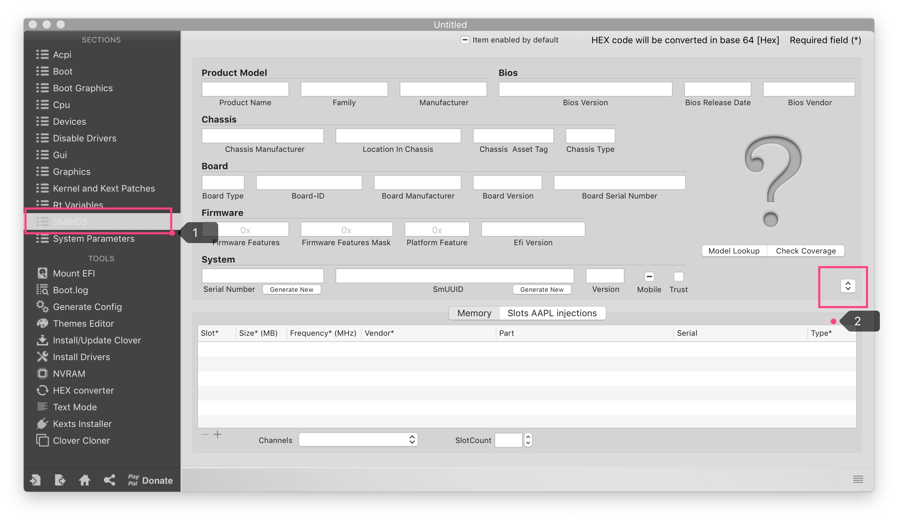
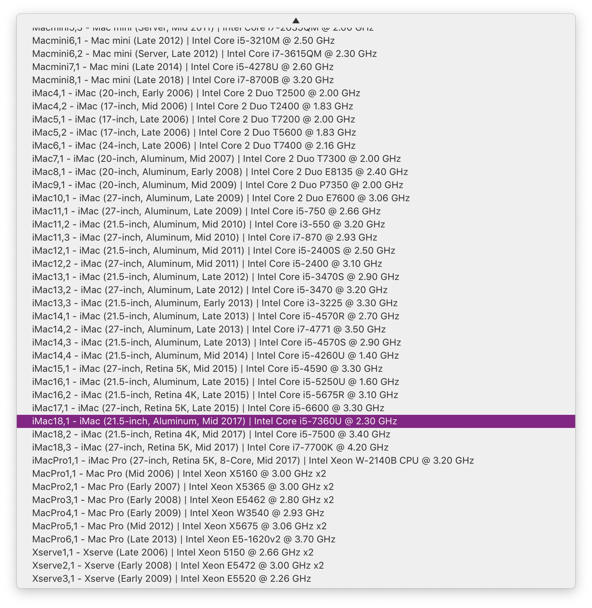

# Post installation: fill SMBIOS info

- open `EFI/CLOVER/config.plist` with Clover Configurator
- generate SMBIOS info with 'iMac18,1'. if you use eGPU, select 'iMac18,3' instead.
  
  
- Actually, we need 4 values only, delete others if you want.
  ```xml
  <key>BoardSerialNumber</key>
  <string>XXXX</string>
  <key>ProductName</key>
  <string>iMac18,1</string>
  <key>SerialNumber</key>
  <string>XXXX</string>
  <key>SmUUID</key>
  <string>XXXX</string>
  ```
