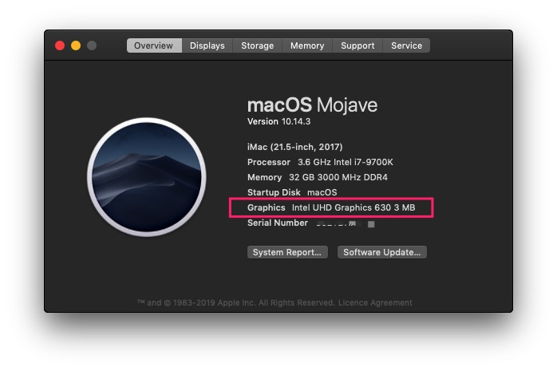
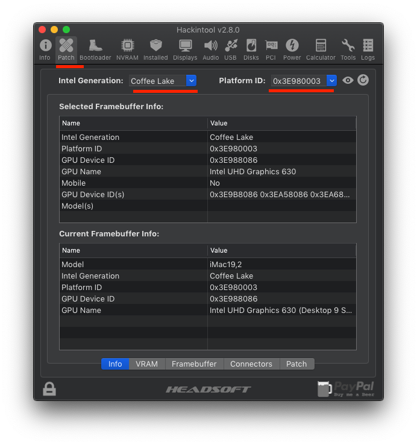
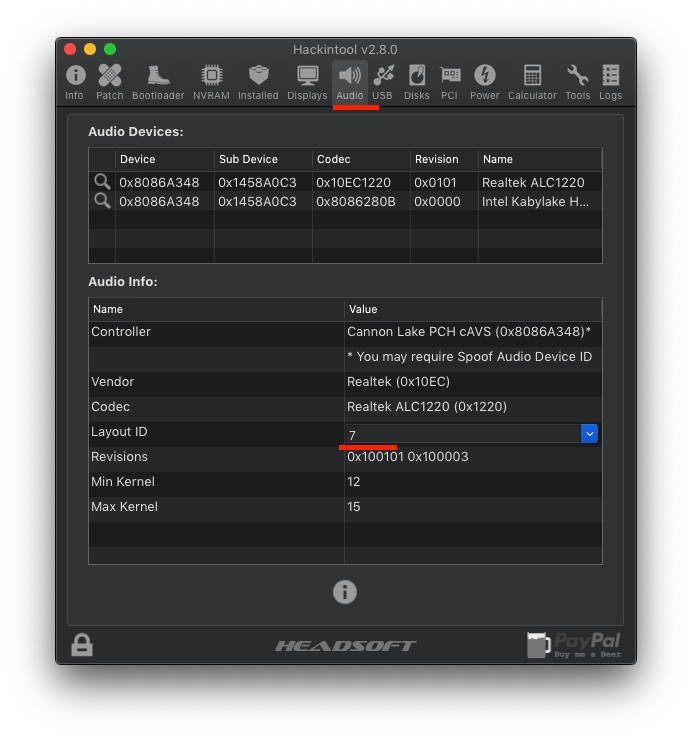
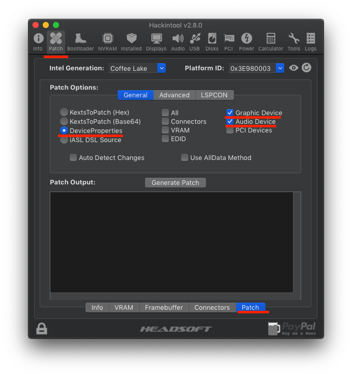
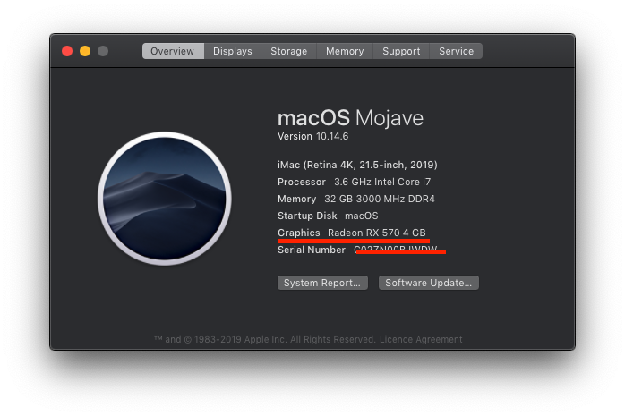
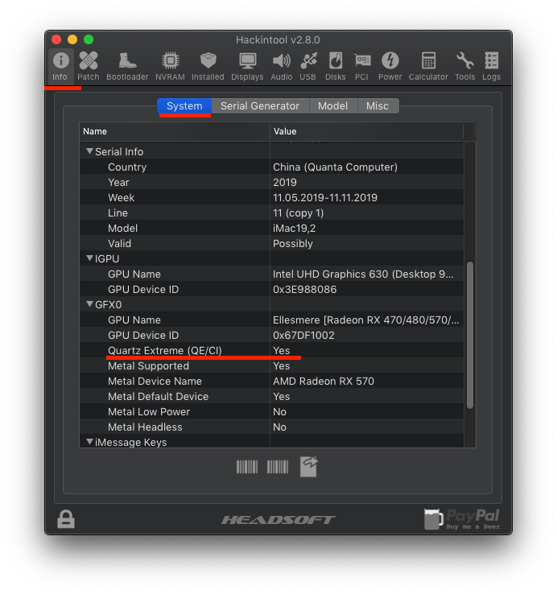

# Post installation: fix audio and iGPU

  Without audio and video patch, system has no sounds and GPU mem size is 3MB only.

  

  Download [WhateverGreen.kext](https://github.com/acidanthera/WhateverGreen/releases) and [AppleALC.kext](https://github.com/acidanthera/AppleALC/releases) to SSD's EFI/Clover/Other, WhateverGreen fixes lots of issues with iGPU, AMD, and Nvidia graphics, AppleALC.kext helps us get audio working.  Follow the [guide](https://www.tonymacx86.com/threads/an-idiots-guide-to-lilu-and-its-plug-ins.260063/) to generate a clover patch. The audio layout-id of Gigabyte-Z390I-WIFI should be `7` (`1` also works), the `PlatformId` should be `3E9B0007` if you  use iGPU. If you have a dGPU, `3E980003` should be selected.

- download and open hackintool
- select `macOS 10.14` at the menubar

  

- select `Coffee Lake` as IntelGen. `3E9B0007(iGPU only)` or `3E980003(iGPU + dGPU)` as PlatformId.

  

- select `7` as layout id at audio tab

  

- generate patch

  
  

- copy patch output to config.plist
- after reboot.

  
  
